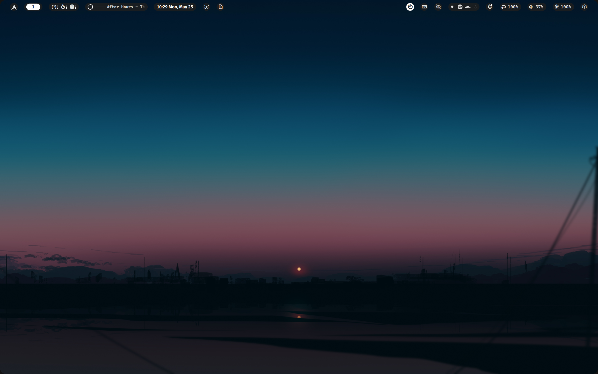
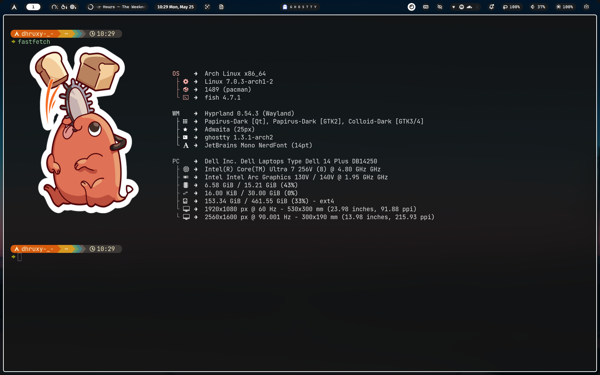
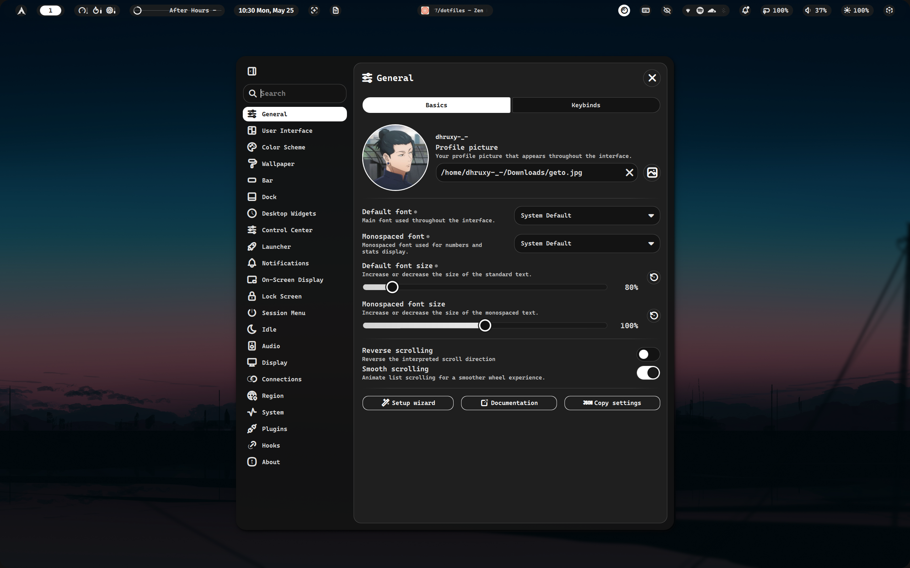
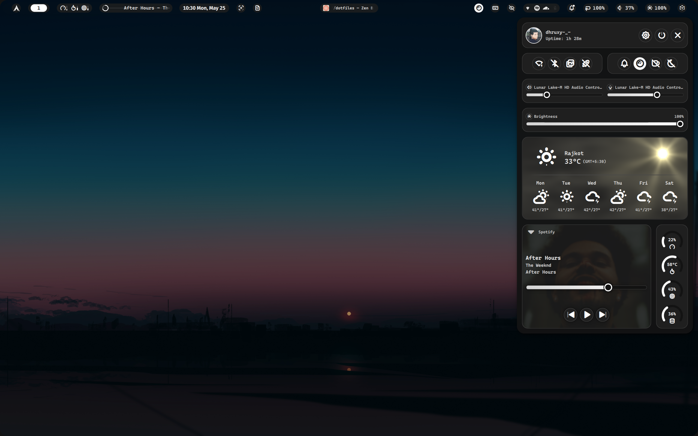
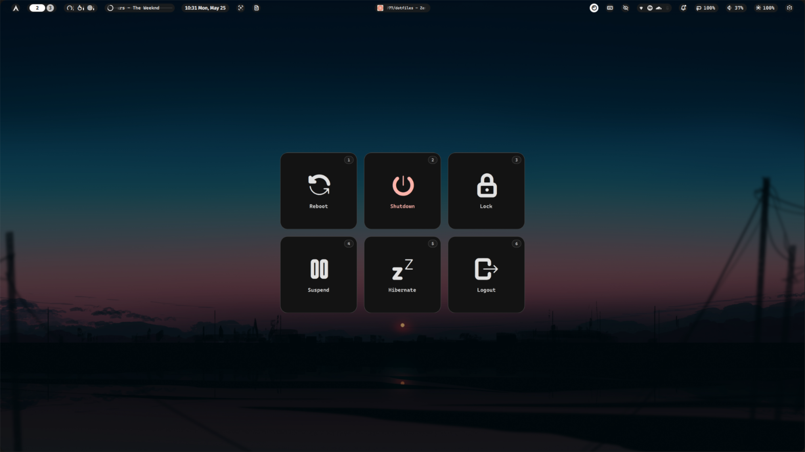
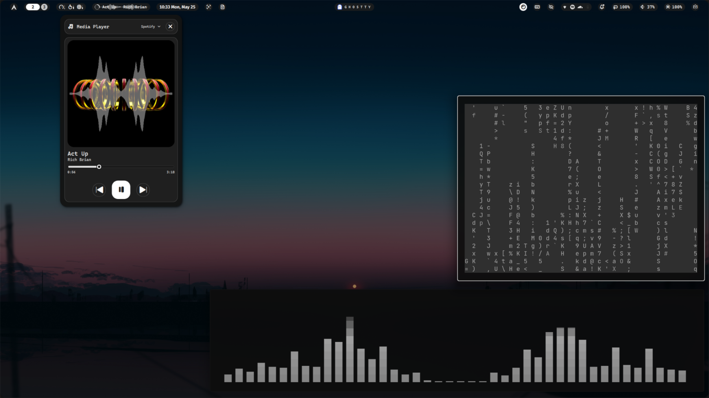
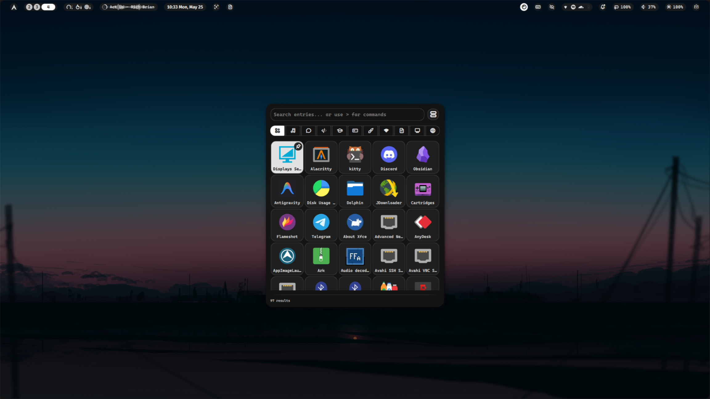
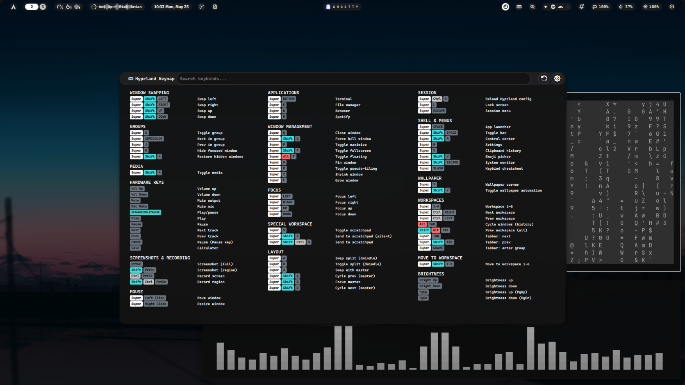
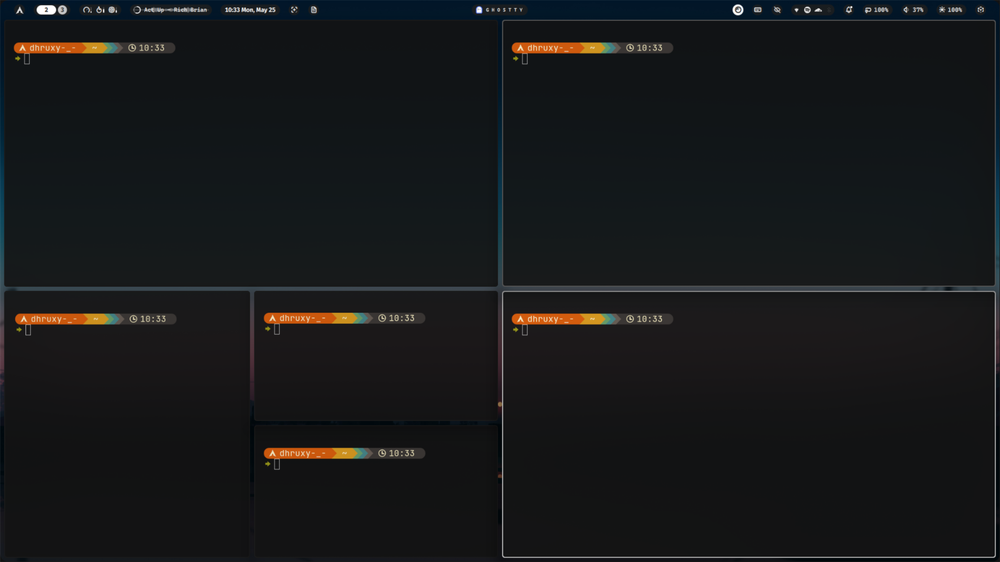

<div align="center">

# ✦ dhruxy-_- dotfiles ✦

**A minimal, dark Hyprland setup powered by the Noctalia shell**



[](https://archlinux.org/)
[](https://hyprland.org/)
[](https://wayland.freedesktop.org/)

</div>

---

## 📸 Screenshots

<details open>
<summary><b>Desktop & Bar</b></summary>
<br>

> Clean desktop with the Noctalia bar at the top — workspace indicators, media info, clock, and system tray.


</details>

<details>
<summary><b>Fastfetch / System Info</b></summary>
<br>

> Running `fastfetch` inside Ghostty, showing system specs on a Dell Inspiron 14 Plus.



</details>

<details>
<summary><b>Noctalia Settings</b></summary>
<br>

> Shell settings panel — tweak fonts, profile, scrolling behavior and more.



</details>

<details>
<summary><b>Control Center</b></summary>
<br>

> Quick-access control center with audio sliders, brightness, weather widget, and Spotify media player.



</details>

<details>
<summary><b>Session Menu</b></summary>
<br>

> Session manager with Reboot, Shutdown, Lock, Suspend, Hibernate, and Logout.



</details>

<details>
<summary><b>Desktop Widgets</b></summary>
<br>

> Music visualizer widget, cava audio visualizer, and a keybind matrix floating on the desktop.



</details>

<details>
<summary><b>App Launcher</b></summary>
<br>

> Noctalia launcher — search apps, run commands, browse clipboard, or pick emojis.



</details>

<details>
<summary><b>Keybind Cheatsheet</b></summary>
<br>

> Full keybind cheatsheet panel, summonable with <kbd>Super</kbd> + <kbd>/</kbd>.



</details>

<details>
<summary><b>Dwindle Tiling</b></summary>
<br>

> Five Ghostty terminals tiled using the Dwindle layout — automatic recursive splitting.



</details>

---

## 🖥️ System Info

| Category | Value |
|----------|-------|
| **OS** | Arch Linux x86\_64 |
| **Kernel** | Linux 7.0.3 |
| **WM** | Hyprland 0.54.3 (Wayland) |
| **Shell** | fish 4.7.1 |
| **Terminal** | Ghostty 1.3.1 |
| **Bar / Shell** | Noctalia (qs) |
| **Icons** | Papirus-Dark |
| **Cursor** | Bibata-Modern-Ice (24px) |
| **Font** | JetBrains Mono NerdFont 14pt |
| **Machine** | Dell 14 Plus DB14250 |
| **CPU** | Intel Core Ultra 7 256V @ 4.80 GHz |
| **GPU** | Intel Arc 130V / 140V |
| **RAM** | 16 GiB / 30 GiB |

---

## 📦 Software Stack

| Role | Package |
|------|---------|
| **Window Manager** | [Hyprland](https://hyprland.org/) |
| **Shell / Bar** | Noctalia (`qs -c noctalia-shell`) |
| **Terminal** | [Ghostty](https://ghostty.org/) |
| **Browser** | [Zen Browser](https://zen-browser.app/) |
| **File Manager** | Thunar |
| **Editor** | Neovim (`nvim`) |
| **Wallpaper** | [swww](https://github.com/LGFae/swww) |
| **Idle Daemon** | hypridle |
| **Screen Lock** | Noctalia lockscreen |
| **Launcher** | Noctalia launcher |
| **Clipboard** | cliphist + wl-paste + wl-clip-persist |
| **Music** | Spotify (spotify-launcher) |
| **Notifications** | Noctalia (built-in) |
| **Auth Agent** | xfce-polkit |
| **Screenshots** | hyprshot |

---

## 📁 Directory Structure

```
dotfiles/
├── .config/
│   ├── hypr/
│   │   ├── hyprland.conf          # Main config entry point
│   │   ├── hypridle.conf          # Idle / screen timeout rules
│   │   ├── monitors.conf          # Monitor layout
│   │   ├── workspaces.conf        # Workspace assignments
│   │   ├── configs/
│   │   │   ├── animations.conf    # Bezier curves & animation config
│   │   │   ├── binds.conf         # All keybindings
│   │   │   ├── environ.conf       # Environment variables
│   │   │   ├── exec.conf          # exec-once startup commands
│   │   │   ├── rules.conf         # Window & layer rules
│   │   │   └── settings.conf      # General / decoration / input settings
│   │   └── noctalia/
│   │       └── noctalia-colors.conf  # Noctalia color theme for Hyprland borders
│   ├── alacritty/
│   ├── fastfetch/
│   ├── fish/
│   ├── ghostty/
│   ├── kitty/
│   ├── noctalia/
│   ├── nvim/
│   └── starship.toml
├── .local/
│   └── screensaver/               # Custom screensaver scripts
├── Images/                        # Screenshots used in this README
├── install.sh                     # Automated installation script
└── LICENSE
```

---

## ⚡ Keybindings

> **Modifier key: `Super` (Windows key)**

### 🪟 Window Management

| Keybind | Action |
|---------|--------|
| `Super + Q` | Close focused window |
| `Super + Shift + Q` | Force kill window |
| `Super + F` | Toggle maximize |
| `Super + Shift + F` | Toggle fullscreen |
| `Super + Alt + F` | Toggle floating |
| `Super + U` | Pin window |
| `Super + P` | Toggle pseudo-tiling |
| `Super + Z` | Shrink window |
| `Super + C` | Grow window |

### 🎯 Focus & Movement

| Keybind | Action |
|---------|--------|
| `Super + Arrow Keys` | Move focus (left/right/up/down) |
| `Super + Shift + Arrow Keys` | Swap window in direction |
| `Super + LMB` (drag) | Move floating window |
| `Super + RMB` (drag) | Resize window |

### 🗂️ Workspaces

| Keybind | Action |
|---------|--------|
| `Super + 1–6` | Switch to workspace 1–6 |
| `Super + Shift + 1–6` | Move window to workspace 1–6 |
| `Super + Ctrl + →` | Next workspace |
| `Super + Ctrl + ←` | Previous workspace |
| `Alt + Tab` | Cycle windows (history) |

### 🔲 Groups & Tabber

| Keybind | Action |
|---------|--------|
| `Super + O` | Toggle group |
| `Super + ;` | Next in group |
| `Super + J` | Previous in group |
| `Super + H` | Hide focused window |
| `Super + Shift + H` | Restore hidden windows |
| `Super + Tab` | Tabber: next tab |
| `Super + Shift + Tab` | Tabber: previous tab |
| `Super + Grave` | Tabber: enter group |

### 🗃️ Layout (Dwindle / Master)

| Keybind | Action |
|---------|--------|
| `Super + A` | Swap split (dwindle) |
| `Super + D` | Toggle split (dwindle) |
| `Super + X` | Swap with master |
| `Super + Shift + A` | Cycle prev (master) |
| `Super + Shift + D` | Cycle next (master) |
| `Super + Shift + X` | Focus master |

### 🪄 Special Workspace (Scratchpad)

| Keybind | Action |
|---------|--------|
| `Super + S` | Toggle scratchpad |
| `Super + Shift + S` | Send to scratchpad (silent) |
| `Super + Shift + Ctrl + S` | Send to scratchpad |

### 🚀 Applications

| Keybind | Action |
|---------|--------|
| `Super + Return` | Terminal (Ghostty) |
| `Super + E` | File manager (Thunar) |
| `Super + W` | Browser (Zen) |
| `Super + M` | Spotify |

### 🐚 Shell & Menus

| Keybind | Action |
|---------|--------|
| `Super + Space` | App launcher |
| `Super + Shift + Space` | Toggle bar |
| `Super + Shift + R` | Control center |
| `Super + R` | Settings |
| `Super + V` | Clipboard history |
| `Super + Shift + V` | Emoji picker |
| `Super + Shift + Escape` | System monitor |
| `Super + /` | Keybind cheatsheet |

### 🖼️ Wallpaper

| Keybind | Action |
|---------|--------|
| `Super + Y` | Change wallpaper |
| `Super + Shift + Y` | Toggle wallpaper automation |

### 🔐 Session

| Keybind | Action |
|---------|--------|
| `Super + L` | Lock screen |
| `Super + Escape` | Session menu (shutdown, reboot…) |
| `Super + Ctrl + R` | Reload Hyprland config |

### 🎵 Media & Hardware

| Keybind | Action |
|---------|--------|
| `XF86AudioRaiseVolume` | Volume up |
| `XF86AudioLowerVolume` | Volume down |
| `XF86AudioMute` | Mute output |
| `XF86AudioMicMute` | Mute mic |
| `XF86AudioPlay/Pause/Next` | Media controls |
| `XF86MonBrightnessUp/Down` | Brightness control |
| `PgUp / PgDn` | Brightness up / down |
| `Print` | Screenshot (full output) |
| `Super + Print` | Screenshot (region select) |

---

## 🎨 Theme — Noctalia

The color scheme used across Hyprland borders is **Noctalia** — a dark monochrome palette:

| Role | Color |
|------|-------|
| Primary (active border) | `#ffffff` |
| Surface (inactive border) | `#131313` |
| Secondary (group border) | `#c6c6c6` |
| Error (locked border) | `#ffb4ab` |
| Surface Lowest | `#0e0e0e` |

The animations are tuned with custom bezier curves for a premium, snappy feel:
- **spring** — pop-in windows with a satisfying overshoot
- **whip** — frictionless workspace and window slides
- **blackHole** — fast, decisive close/fade-out
- **linear** — smooth looping border angle animation

---

## 🚀 Installation

> **Requires Arch Linux (or an Arch-based distro)**

### Automated (recommended)

```bash
git clone https://github.com/Dhruxy077/dotfiles.git
cd dotfiles
chmod +x install.sh
./install.sh
```

The install script will:
- Check for and install all required dependencies via `pacman` / `yay`
- Copy all configs to `~/.config/`
- Copy scripts to `~/.local/bin/`
- Set up Hyprland to launch on login

### Manual

```bash
# Clone the repo
git clone https://github.com/Dhruxy077/dotfiles.git ~/dotfiles

# Copy configs
cp -r dotfiles/.config/* ~/.config/
cp -r dotfiles/.local/* ~/.local/

# Make scripts executable
chmod +x ~/.local/bin/**
```

---

## 📋 Dependencies

<details>
<summary>Click to expand full dependency list</summary>

### Core
- `hyprland` — Window manager
- `wayland` `xorg-xwayland` — Display protocols

### Shell / Bar
- `quickshell` (`qs`) with the **Noctalia** shell config

### Terminal & Shell
- `ghostty` — Primary terminal
- `kitty` / `alacritty` — Alternate terminals
- `fish` — Shell
- `starship` — Prompt

### Wallpaper & Idle
- `swww` — Wallpaper daemon
- `hypridle` — Idle management

### Clipboard
- `cliphist`
- `wl-clipboard`
- `wl-clip-persist`

### Fonts & Icons
- `ttf-jetbrains-mono-nerd` — Terminal/UI font
- `papirus-icon-theme` — Icon theme

### Cursor
- `bibata-cursor-theme` — `Bibata-Modern-Ice`

### Utilities
- `hyprshot` — Screenshots
- `brightnessctl` — Brightness control
- `playerctl` — Media control
- `thunar` — File manager
- `xfce-polkit` — Authentication agent
- `neovim` — Editor
- `fastfetch` — System info

### Optional
- `spotify-launcher` — Spotify music client
- `zen-browser` — Browser

</details>

---

## 📄 License

This project is licensed under the [MIT License](LICENSE).

---

<div align="center">

Made with ❤️ by **dhruxy-_-**

</div>
